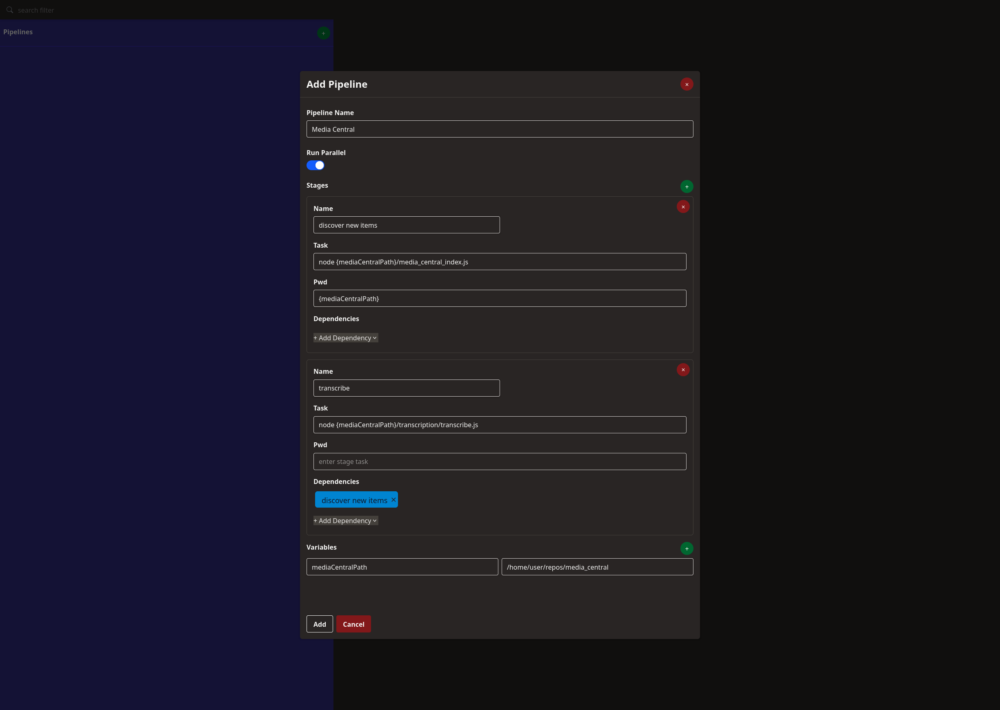

# ▶ Pipeline

Pipeline is a tool for running a list of tasks. It allows for defining tasks with peer dependencies and running in parallel.
Pipeline can be run as a standalone cmd tool and in the future as a server + UI.

## Table of contents

- [🚀 Getting Started](#-getting-started)
- [📓 Future Plans](#-future-plans)
- [📃 Pipeline Definition Schema](#-pipeline-definition-schema)


## 🚀 Getting Started

Go is required to be installed to run this project from src. You can find a guide on installing Go for your system [here](https://go.dev/doc/install)

1. Make an .env file at the root of the project directory, with your values for the variables in .env.sample

2. Build a binary with `go build -o pipeline`.

3. Define tasks for the pipeline using json. Refer to [📃 Pipeline Definition Schema](#-pipeline-definition-schema) for description of available properties. Below is an example:

    ```json
    {
        "name": "media_central",
        "parallel": true,
        "variable_file": "variables.txt",
        "stages": [
            {
                "name": "discover new items",
                "task": "node",
                "args": ["{mediaCentralPath}/media_central_index.js"],
                "pwd": "{mediaCentralPath}",
                "env": ["FFMPEG_PATH=/usr/bin"],
                "depends_on": []
            },
            {
                "name": "transcribe",
                "task": "node",
                "args": ["{mediaCentralPath}/transcription/transcribe.js"],
                "depends_on": ["discover new items"]
            },
            {
                "name": "get tags",
                "task": "node",
                "args": ["{mediaCentralPath}/utils/getTags.js"],
                "depends_on": ["discover new items"],
                "skip": true
            },
            {
                "name": "refresh cuts",
                "task": "node",
                "args": ["{cutsPath}/utils.js"],
                "depends_on": ["discover new items"]
            },
            {
                "name": "create similarity map",
                "task": "python",
                "args": ["{mediaCentralPath}/inference/cluster.py"],
                "depends_on": ["discover new items", "get tags", "transcribe"]
            },
            {
                "name": "backup",
                "task": "bash",
                "args": ["{mediaCentralPath}/utils/backup.sh"],
                "depends_on": ["discover new items", "create similarity map"]
            }
        ]
    }
    ```

4. Create the variable file (Optional). Variables in the file are define as `key=value`, 1 per line. *Variables are defined in the pipeline definition with `{}`*

5. Run with `pipeline run --definition pipeline.json`

## 📓 Future Plans

- [ ] Build server and UI to manage pipelines and runs. This is partially implemented:



## 📃 Pipeline Definition Schema

```ts
{
    name: string, // pipeline name - required
    parallel: boolean, // run task 1 by 1 or in parallel, respecting dependencies - default false
    variable_file: string, // path to the file to use for variables - optional
    stages: [
        {
            name: string, // stage name - required
            task: string, // action to run (supports variables in string) - required
            args: []string // the args to be passed to the command in 'task' - optional
            pwd: string, // the working directory the task should be run - optional
            env: []string, // env vars for the task run the format [KEY=VALUE]
            depends_on: []string, // list of stage names to have as dependency - optional
            skip: bool // whether to skip this stage in a given run - optional
        }
    ]
}
```

**Note: Stages with dependencies will block subsequent stages in parallel mode. Take care to define stages in optimal order.**
